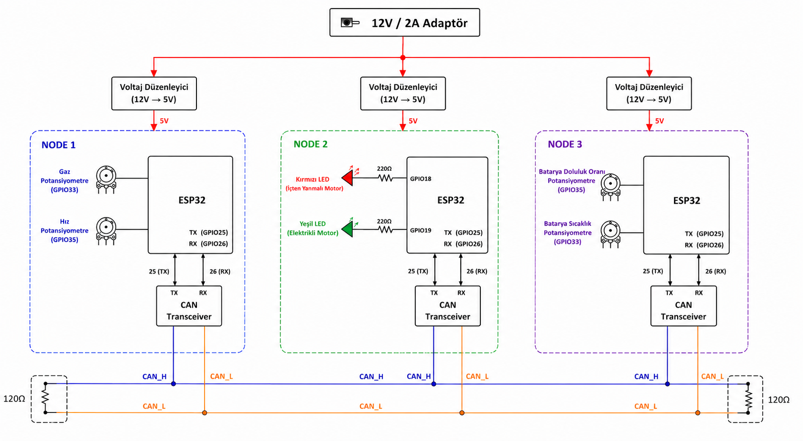

# CAN Bus Based Hybrid Vehicle Powertrain Control System

This project implements a 3-node distributed CAN bus network that simulates hybrid vehicle powertrain state transitions. The system monitors battery health parameters, driving telemetry, and dynamically determines the optimal power source in real time.

---

## System Architecture

---

## Network Topology & Nodes

All nodes communicate over a single-channel CAN bus at a baud rate of **500 kbps** with 120Ω termination resistors.

| Node | Function | I/O & Telemetry | CAN ID | Transmission Rate |
| :--- | :--- | :--- | :--- | :--- |
| **Node 1 (Decision & Control)** | Executes priority arbitration and drives motor indicators | Green LED (EV), Red LED (ICE) | 0x400 | Event-based |
| **Node 2 (Battery Monitor)** | Battery temperature and State of Charge (SOC) tracking | 2x 10kΩ Potentiometers | 0x200 | 500 ms |
| **Node 3 (Driving Dynamics)** | Throttle position and vehicle speed monitoring | 2x 10kΩ Potentiometers | 0x300 | 500 ms |

---

## Control Logic (Priority Arbitration)

Node 1 evaluates incoming telemetry cyclically using a layered priority arbitration logic:

1. **Safety Layer (Highest Priority):** Battery Temp > 60°C or SOC < 15% -> **ICE Only**
2. **Speed Threshold Layer:** Vehicle Speed > 120 km/h -> **ICE Only**
3. **Efficiency Layer:** Vehicle Speed < 30 km/h and Throttle < 40% -> **EV Only**
4. **Performance / Hybrid Layer:** Vehicle Speed < 120 km/h and Throttle > 40% (and default states) -> **EV + ICE**
